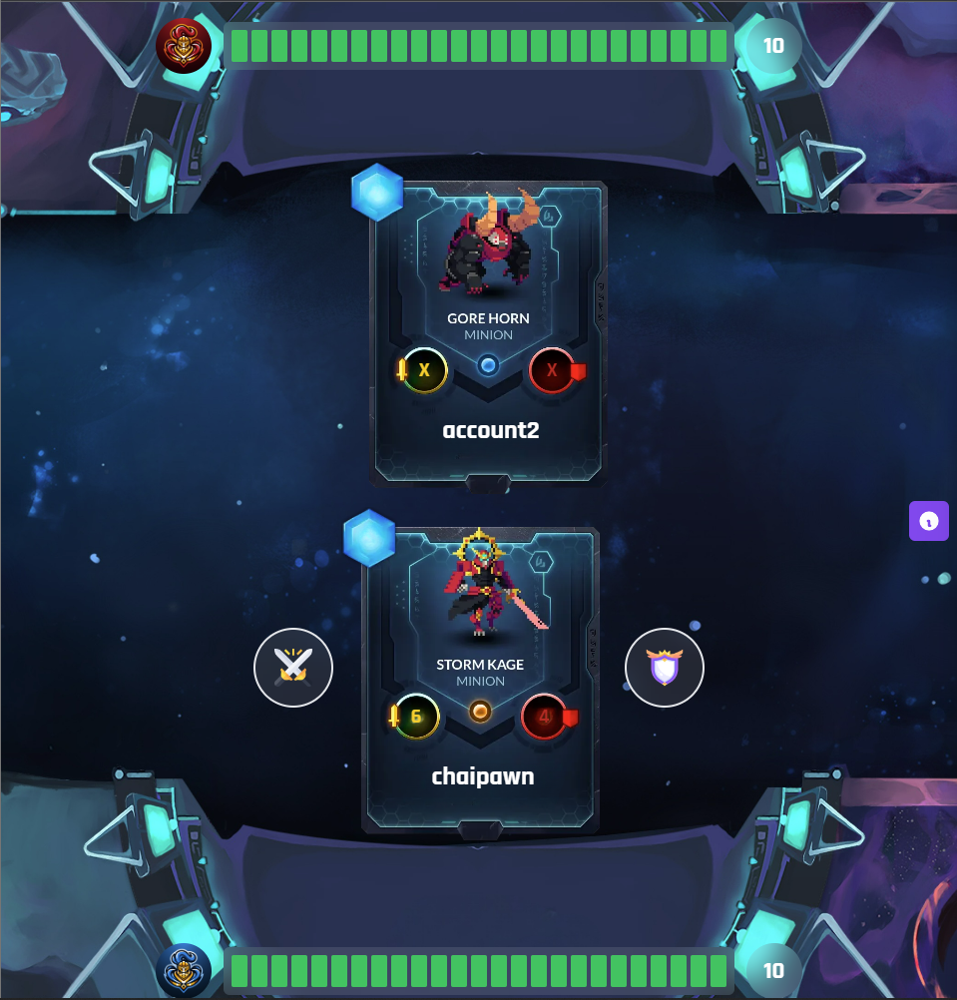

# Avax Gods - Online Multiplayer Web3 NFT Card Game

## Description

This is a code from the corresponding [**video tutorial**](https://youtu.be/C9ctoK4M9Bk) in [JavaScript Mastery](https://www.youtube.com/@javascriptmastery) on Youtube.

## Screenshot



## How to run web application

Install [Core | Crypto & NFT Wallet Extension](https://chrome.google.com/webstore/detail/core-crypto-nft-wallet-ex/agoakfejjabomempkjlepdflaleeobhb) on Google Chrome

```bash
npm install -g pnpm
cd ./client/
pnpm install
pnpm run dev
```

## How to deploy smart contract

Create file .env from file .env.template and update ***PRIVATE_KEY*** from [Avalanche Wallet](https://wallet.avax.network/)

```bash
npm install -g pnpm
cd ./web3/
pnpm install
pnpm exec hardhat run scripts/deploy.ts --network fuji
```
